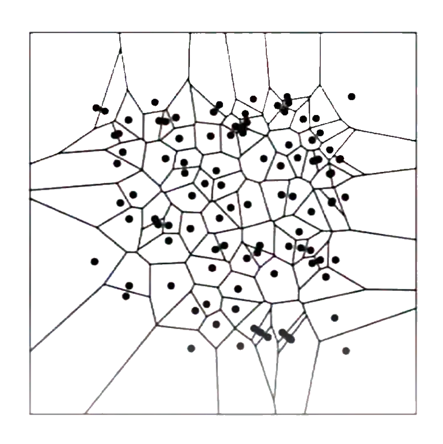
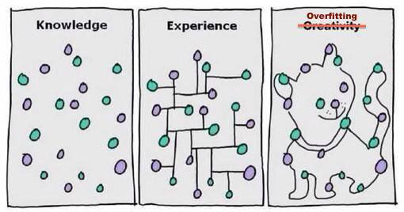
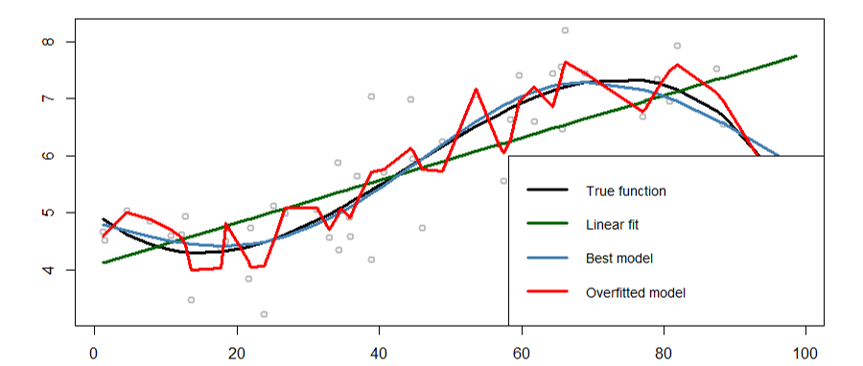
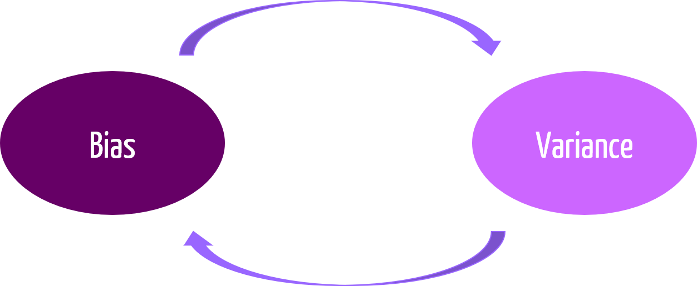

class: center, middle, bg_title, hide-count


```{r setup, include=FALSE}
options(
  tmltools.dir.version = FALSE,
  htmltools.preserve.raw = FALSE
)

knitr::opts_chunk$set(
  fig.retina = 3,
  warning = FALSE,
  message = FALSE,
  comment = "",
  out.width = "100%"
)
library(knitr)
library(xaringanExtra)
library(xaringanthemer)

library(tidyverse)
library(gridExtra)
library(here)

library(countdown)
library(metathis)

options(width = 59) # fit into the right-column slides

```


```{r xaringans, echo=FALSE}
# https://github.com/gadenbuie/xaringanExtra
use_tachyons()
use_share_again()
use_panelset()
use_clipboard()
use_editable(expires = 1)
use_scribble()
use_extra_styles(
  hover_code_line = TRUE,         #<<
  mute_unhighlighted_code = TRUE  #<<
)
use_progress_bar(color = "#0051BA", location = "top")
```

```{r style-share-again, echo=FALSE}
style_share_again(
  share_buttons = c("twitter", "linkedin", "pocket")
)
```


```{r meta, echo=FALSE}
meta() %>%
  meta_general(
    description = "Artificial Intelligence and Machine Learning in Supporting Clinical Decision",
    generator = "xaringan and remark.js"
  ) %>% 
  meta_name("github-repo" = "CorradoLanera/ws-mlt") %>% 
  meta_social(
    title = "Artificial Intelligence and Machine Learning in Supporting Clinical Decision",
    url = "https://CorradoLanera.github.io/ws-mlt",
    image = "https://github.com/CorradoLanera/ws-mlt/raw/main/img/cover.jpg",
    og_type = "website",
    og_author = "UBEP",
    twitter_card_type = "summary",
    twitter_creator = "@CorradoLanera"
  )
```

```{css, echo=FALSE}
.left-code {
  color: #777;
  width: 38%;
  height: 92%;
  float: left;
}
.right-code {
  color: #777;
  width: 55%;
  height: 92%;
  float: right;
  padding-top: 0.5em;
}
.left-plot {
  width: 43%;
  float: left;
}
.right-plot {
  width: 60%;
  float: right;
}
.hide-count .remark-slide-number {
  display: none;
}

.bg_title {
  position: relative;
  z-index: 1;
}

.bg_title::before {    
      content: "";
      background-image: url('img/bg1.png');
      background-size: contain;
      position: absolute;
      top: 0px;
      right: 0px;
      bottom: 0px;
      left: 0px;
      opacity: 0.3;
      z-index: -1;
}

```


```{r xaringan-themer, include=FALSE, warning=FALSE}
red <- "#f34213"
purple <- "#3e2f5b"
orange <- "#ff8811"
green <- "#136f63"
white <- "#FFFFFF"
pastel_orange <- "#F97B64"
blu_gray <- "#1F4257"
style_duo_accent(
    colors = c(
        red = red,
        purple = purple,
        orange = orange,
        green = green,
        white = white,
        pastel_orange = pastel_orange,
        blu_gray = blu_gray
    )
)
```


<br>
# **.orange[How] Machine .orange[Learning]**<br>and **Artificial .orange[Intelligence]** can<br>**Support Clinical .orange[Decision]**

Slide at: https://CorradoLanera.github.io/ws-mlt  
```{r, echo=FALSE, out.width = "12%"}

```
<br>

**Biostatistics Seminaries** - Padova, 2022/09/28 -

Ph.D. Course in Pharmacological Sciences --- University of Padova

Corrado Lanera | [**Unit of Biostatistics, Epidemiology, and Public Health**](https://www.unipd-ubep.it/)


---
class: hide-count
.panelset[
```{r, panelset = TRUE, fig.width=6.4, fig.height=3.6}
# The downloaded csv with graph data of your PubMed query
pmlt_path <- here("data/PubMed_Timeline_Results_by_Year.csv")

pmlt_path |> 
  read_csv(skip = 1L) |>  # The first line is the query!
  ggplot(aes(x = Year, y = Count)) + 
  geom_point() +
  geom_label(
    aes(label = glue::glue("Total = {sum(Count)}")),
    x = 1995,
    y = 3000
  ) +
  labs(
    title = "Historical progression of MLT/AI papers in \"your\" field",
# The first line is the query :-)
    caption = read_lines(pmlt_path, n_max = 1)
  )
```
]


---
class: inverse, hide-count
# What we are going to see

Purpose of this seminar is to introducing **.orange[what is]** Machine Learning, why/in what is different from other (statistical) tools, how to understand (and **.orange[trust]**!) it's results, and looking at **.orange[some example]** and **.orange[best practice]** in conducing a machine learning project.

<br>
<br>

My principal aim is to let you able to start **.orange[understanding]** (and **.orange[evaluating]** the quality!) of a machine learning project when used for clinical purposes.

<br>
<br>
<br>
<br>

**.orange[Promise]: I do not show you any (other) R code `r emo::ji("halo")`**


---
class: hide-count
# .orange[Acknowledgement]

The following slides and their contents were produced thanks to the preciuos work of .orange[**Paola Berchialla**] (UniTo/DSCB)

.center[
```{r, echo=FALSE, out.width = "50%"}
knitr::include_graphics(c("img/thankyou-robot.jpg"))
```
]


---
class: inverse, bottom, right, hide-count


```{r, echo=FALSE, out.width = "50%"}
knitr::include_graphics("img/profilo_CL.jpg")
```
# Find me at...


[`r fontawesome::fa("link")`](https://www.unipd-ubep.it/) [**www.unipd-ubep.it**](https://www.unipd-ubep.it/)

[`r fontawesome::fa("github")`](https://github.com/UBESP-DCTV)
**@UBESP-DCTV**

[`r fontawesome::fa("github")`](https://github.com/corradolanera)
[`r fontawesome::fa("twitter")`](https://twitter.com/corradolanera)
[`r fontawesome::fa("telegram-plane")`](https://telegram.me/CorradoLanera)
**@CorradoLanera**

[`r fontawesome::fa("mail-bulk")`](mailto:Corrado.Lanera@ubep.unipd.it) [**Corrado.Lanera**__.orange[@ubep.unipd.it]__](mailto:Corrado.Lanera@ubep.unipd.it)

[`r fontawesome::fa("calendar-check")`](https://calendly.com/corradolanera) [**calendly.com/corradolanera**](https://calendly.com/corradolanera)

---
class: inverse, middle
# .center[**.orange[Overview]**]

- .orange[**Overview**]: what does it means "Machine Learning"?

- .orange[**Classifiers**]

- Model .orange[**selection**] and .orange[**evaluation**]

- .orange[**Neural Networks**] and .orange[**Deep Learning**]

- A Machine Learning .orange[**usecase**] project in healthcare

- .orange[**Best practices**] for implementing Machine Learning


---
class: inverse, middle, center, hide-count
# .orange[Overview]

What does it means "Machine Learning"?


---
# .orange[What is **Machine Learning**]
  

.bg-washed-green.b--dark-green.ba.bw2.br3.shadow-5.ph4.mt1[
  .left[
    Machine Learning deals with the study, the design and the development of algorithms that give computers the capability to learn without being **explicitly** programmed.
  ]
  
  .tr[
    — Arthur Samuel, 1959
  ]
]

```{r, echo=FALSE, message=FALSE, warning=FALSE, fig.align='center', out.width="70%"}
include_graphics("img/samuel.png")
```


---
# .orange[What is **Machine Learning**]
  
.bg-washed-green.b--dark-green.ba.bw2.br3.shadow-5.ph4.mt1[
  .left[
    A computer program is said to learn from **experience** (E) with respect to some class of **tasks** (T) and performance measure  (P), if its **performance** at the given task improves with **experience**
  ]
  
  .tr[
    — _Machine Learning_ - Mitchell, 1997
  ]
]

.pull-left[

```{r, echo=FALSE, message=FALSE, warning=FALSE, fig.align='center', out.width="100%"}

```
]
.pull-right[

<br>

**.orange[Learning]**: performance on **T** as measured by **P** improves with **E**.

<br>
<small>
  
E.g., Misclassification error (**P**) for diagnoses' classification (**T**) improves (i.e., become lower) after training on additional data (**E**).

E.g., Misclassification error (**P**) for diagnoses' classification (**T**) improves (i.e., become lower) after additional iterations of the training procedure (**E**) on the same data-set.
</small>
]

---
# .orange[What is **Machine Learning**]
  

.bg-washed-green.b--dark-green.ba.bw2.br3.shadow-5.ph4.mt1[
  .left[
    A task (red box) requires an appropriate mapping - a model- from data described by feature to outputs. **Obtaining** such mapping from training data is what constitute a **learning problem** (blue box).
  ]
  
  .tr[
    — _Machine Learning_ - Peter Flach, 2012
  ]
]


.left-column[
```{r, echo=FALSE, message=FALSE, warning=FALSE, fig.align='center', out.width="100%"}

```
]
.right-column[
```{r, echo=FALSE, message=FALSE, warning=FALSE, out.width="100%"}
include_graphics("img/flach_learning_problem.png")
```
]


---
# .orange[Task]
  
A __task__ is something the ML must carry out

- the process of learning itself is not the task

- _Learning_ is .orange[the act of generate models] having the ability to perform the task


<br>
<br>


A __task__ is defined in terms of _how the ML should process a collection of Examples_, i.e. a .orange[dataset].


---
# .orange[Learning: are cars "learning"?!]

<iframe width="800" height="450" src="https://www.youtube.com/embed/Aut32pR5PQA" title="YouTube video player" frameborder="0" allow="accelerometer; autoplay; clipboard-write; encrypted-media; gyroscope; picture-in-picture" allowfullscreen></iframe>

... or is the generative models which learns to produce well trained cars!?

---
# .orange[Task: Example]
  
  
<small>

**Learning Problem** | Task **T**  
---------------------|------------
Learning Checkers    | **Playing checkers**
Handwriting recognition | **Recognizing/Classifying handwritten words/numbers within images**
Self-driving car | **Driving from A to B**
Diseases extraction from EHR | **classify EHR by the disease reported (in free-text natural language)** 
Describe patient movement in bed | **At any given time provide position and dynamics of patients**

</small>


---
# .orange[Performance]
  
A __performance__ is a quantitative measure for assessing the ability of ML

- performance is measured on the task being carried out

Usually __performance__ is measured in terms of:
  
- .orange[_accuracy_]: proportion of examples for which the model produces the correct output.

- .orange[_error rate_]: proportion of examples for which the model produces the incorrect output.

<br>
<br>
<br>
  

#### .orange[**WARNING**: unbalanced data require balanced metrics!]
  
  
  
---
# .orange[Performance: Example]
  
<small>

**Learning Problem** | Task **T** | Performance **P** 
---------------------|------------|-------------------
Learning Checkers    | Playing checkers | **% games won **
Handwriting recognition | Recognizing/Classifying handwritten words/numbers within images | **% correctly classified words **
Self-driving car | Driving from A to B | **Average distance traveled before an error (as judged by humans)**
Diseases extraction from EHR | classify EHR by the disease reported (in free-text natural language) | **% of EHR correctly classified**
Describe patient movement in bed | At any given time provide position and dynamics of patients | **% average error in position or dynamics**

</small>

---
#.orange[Experience]
  
.orange[__Experience__] is primarily determined by the amount of supervision during the learning process and the availability of labeled data


---
#.orange[Experience: Example]
  
<small>

**Learning Problem** | Task **T** | Performance **P** | Experience **E** 
---------------------|------------|-------------------|-----------------
Learning Checkers    | Playing checkers | % games won | **playing (against itself)**
Handwriting recognition | Recognizing/Classifying handwritten words/numbers within images | % correctly classified words | **process data sets of handwritten words with given classification**
Self-driving car | Driving from A to B | Average distance traveled before an error (as judged by humans) | **Sequence of videos, still images, and steering commands recorded while observing a human driver**
Diseases extraction from EHR | classify EHR by the disease reported (in free-text natural language) | % of EHR correctly classified | **process EHRs with given classification**
Describe patient movement in bed | At any given time provide position and dynamics of patients | % average error in position or dynamics | **time-series of patient kinetic measures taken from wearable devices and bed weight sensors, and position and dynamics collected by videos recorded observing inbed patients**

</small>


---
# .orange[How do Machines **learn**?]
  
Machine learning is concerned with finding functions that **_best_ predict** outputs (responses), given data inputs (predictors)

$$Y \simeq f(X)$$ 
  


```{r, echo=FALSE, message=FALSE, warning=FALSE, fig.align='center', out.width="60%"}
knitr::include_graphics("img/ml-process.png")
```

.orange[_Learners_] are algorithms that improve their skills (in producing better models/functions) by learning from old/known .orange[__(training)__] data.

<br>
<br>

> A .orange[_learner_] uses data and experience to perform better over time (i.e., producing new models that performs better than the previous ones)


---
# .orange[How do Machines **learn**?]
  
  
  
.left-code[
In traditional programming:
- **provide** an algorithm (a finite set of instructions)
- **provide** .orange[input] data (no training/new distinction)
- **obtain** the desired result.


In machine learning:
- **provide** the .orange[training] input (data)
- **provide** the .orange[training] known/desired result
- **obtain** the .orange[learning algorithm] (ingesting _new_ data and returning _new_ outputs).

Machine Learning problems are .orange[*optimisation*] ones.

]

.right-plot[
  
```{r, echo=FALSE, message=FALSE, warning=FALSE, fig.align='center', out.width="100%"}
include_graphics("img/MLvsTrad.png")
```
]


---
# Types of .orange[learning]

#### .orange[Unsupervised] learning

> The input data is _not labeled_ (there are not right answers!)

Data is given to the model, which is left to learn optimal .orange[patterns]/.orange[clusters].


#### (Passive) .orange[Supervised] learning

> The learning algorithm is provided with a set of inputs along with the corresponding .orange[correct] outputs.

The algorithm compares its current inferred output with the correct one to learn from its .orange[errors] (i.e., to minimize it).


#### .orange[Active] learning

> The learning algorithm .orange[interactively] queries a user (the _oracle_) to label new data with the desired (correct) outputs.

With input data labeled on the fly by .orange[oracle's knowledge], the model cycles query/train stages on the left unlabeled data.


---
# .orange[Basic **components**]

.orange[**Training** dataset]: data used as input to the learner to train the model

.orange[**Validation** dataset]: data used by the learner for validation and optimization

.orange[Training model]: the ML artifact that comes out of the training process

.orange[Cost (or loss) function]: a function to optimize in the ML system (sum of squared errors over the training data set)

.orange[**Test** dataset]: data provided to the trained model for performance estimations


---
class: middle, hide-count, inverse

# .center[.orange[Break]]

(Unordered) tips: 
- get up
- stretch
- look _far away_ (relax your eyes)
- hydrate
- go to the bathroom

```{r, echo = FALSE}
countdown(minutes = 10, warn_when = 3, play_sound = TRUE,
          left = "65%", bottom = "5%")
```


---
class: inverse, middle, center, hide-count
# .orange[Classifiers]


---
class: middle center hide-count

```{r, echo=FALSE, message=FALSE, warning=FALSE, fig.align='center', out.width="100%"}
include_graphics("img/food.jpg")
```


---
# .orange[Classification]

Does data belong to class A? .orange[_**is this really a heart failure patient?**_]

<br>

Classifiers are the most commonly used ML algorithms in analytics applications


  -  Suggest possible patient diagnoses

  - Identify patients with high readmission risk

  - Automatically alert care providers early in the development of sepsis

  - Define the threshods for _abnormal_ lab results

  - Automatically differentiate between clinical and administrative documents

  - Recommend the most effective wellness or disease management intervention for a patient

  -  many, many more...


---
# .orange[Classification]
  
.left-code[
__Feature space__

- data: points in $\mathbb{R}^d$

- dimensions:  scalar measurements

<br>

__Classifier functions (_classifiers_)__

- a classifier for $K$ classes is a function

$$
f:\mathbb{R}^d \to \{1, \ldots, K \}   
$$
- classifiers carve up the space into regions
]

.right-plot[
  
```{r, echo=FALSE, message=FALSE, warning=FALSE, fig.align="center", out.width="100%"}
include_graphics("img/classification_3.png")
```
  
]


---
# .orange[Quantifying errors]

If $f$ is our classifiers, i.e. for any given $x$ we have $f(x) = \tilde{y}$ is the predicted class (with $y$ the real one), then

**Loss function** (for .orange[K] classes $\{1, \cdots, K\}$):

$$\begin{split}\mathfrak{L}: \{1, \cdots, K\}&\times \{1, \cdots, K\} &\to [0, \infty)\\ (f(x)&,\ y) &\mapsto \mathfrak{L} (f(x),\ y)\end{split}$$

<br>

> If all mistakes are equally bad:
$$\mathfrak{L}(i, j) = \begin{cases}
1 & \textrm {if } i\neq j  \\
0 & \textrm {if } i = j  \\
\end{cases}$$

Note: if the outcome of $f$ is a set of probabilities for the classes, the same definition is valid considering 
$$\mathfrak{L}: \{p_1, \cdots, p_K\} \times \{1, \cdots, K\} \to [0, \infty)$$


---
# .orange[Risk of classifier]
    
If the distribution of the classes is known, the .orange[risk] of classifier is the expected loss

$$
{\rm risk}(f) = \mathbb{E}[\mathfrak{L}(f(X), {\rm true\ class\ of\ } X)]
$$


We can evaluate the classifier by how large its risk is

<br>

> The best way to possibly train a classifier is by **minimizing its risk**

<br>
<br>


> N.B. The above one is a sort of common **_misuse of notation_**: a classifier is **.orange[a (single!) model]**, and **cannot be trained**!! when we say "train a model" the real meaning is 
.center[**"a MLT start producing models, somehow; new ones replacing the prevouses"**.]
Interpreting "replacement" like "modification", we can pretend that a (**.orange[single]**...) model is trained.
  


---
class: inverse, middle, center, hide-count
# .orange[Classifiers]

Main MLT examples

  
---
# .orange[Nearest neighbor]
  
.orange[__Idea:__] use training data itself as classifier

- Given: data point $x$
  
  - Find training data point closest to $x$
  
  - Assign $x$ the label of closest point


---
#.orange[Nearest neighbor]

```{r, echo=FALSE, message=FALSE, warning=FALSE, fig.align="center", out.width="60%"}
include_graphics("img/knn.png")
```

---
##.orange[Nearest neighbor (100 data points)]

```{r, echo=FALSE, message=FALSE, warning=FALSE, fig.align="center", out.width="60%"}

```


---
class: inverse, middle, center, hide-count

# Your turn

.left[
How can we __train__ a model using a nearest neighbor MLT?

(i.e. what can be the _experience_?)
]

```{r, echo = FALSE}
countdown(minutes = 1, warn_when = 10, play_sound = TRUE,
          left = "70%", bottom = "20%")
```


---
# .orange[k-Nearest] Neighbor (kNN)

- Find $k$ closest training points

- Take a majority vote between these points


> .orange[__Rule of thumb:__] 3NN often works surprisingly well


---
##.orange[k-Nearest neighbor]

```{r, echo=FALSE, message=FALSE, warning=FALSE, fig.align="center",fig.cap="https://medium.com/analytics-vidhya/diabetes-classification-with-knn-and-logistic-regression-2edd3760a8c7",  out.width="60%"}
include_graphics("img/knn_k.png")
```


---
class: inverse, middle, center, hide-count

# Your turn

.left[
How can we __train__ a model using a k-nearest neighbor MLT?

(i.e. what can be the _experience_?)
]

```{r, echo = FALSE}
countdown(minutes = 1, warn_when = 10, play_sound = TRUE,
          left = "70%", bottom = "20%")
```

---
class: inverse, middle, center, hide-count

# Your turn

.left[
**Increasing** k, we provide **.orange[more or less] flexibility** to the model?

Which are the **minimum** and **maximum** possible k?
]

```{r, echo = FALSE}
countdown(minutes = 1, warn_when = 10, play_sound = TRUE,
          left = "70%", bottom = "20%")
```


---
#.orange[kNN: drawbacks]

In large dataset, finding nearest data points is expensive

Computational burden grows with dimension

> it is the method of choice when dataset is small

<br>
<br>
<br>
<br>

__What to do for large dataset:__

- Extract a concise summary


---
# .orange[Linear classifiers] 

```{r, echo=FALSE, message=FALSE, warning=FALSE, fig.align="center", out.width="70%"}
include_graphics("img/linear_classifier_3.png")
```


---
# .orange[Linear classifiers] 

```{r, echo=FALSE, message=FALSE, warning=FALSE, fig.align="center", out.width="70%"}
include_graphics("img/linear_classifier_5.png")
```

.center[draw the convex hull]


---
#.orange[Linear classifiers:<br>Maximum margin hyperplane] 


```{r, echo=FALSE, message=FALSE, warning=FALSE, fig.align="center", out.width="70%"}

```
  

.footnote[An hyperplane is a **subspace of co-dimension = 1** of a space (i.e. 1 dimension less then the space ones).

E.g., a line (1D) in a plane (2D); a plane (2D) in a 3D space; a 23D subspace in a 24D space.]

---
#.orange[Linear classifiers:<br>Maximum margin hyperplane]

<br>

```{r, echo=FALSE, message=FALSE, warning=FALSE, fig.align="center", out.width="70%"}
include_graphics("img/linear_classifier_7.png")
```


---
#.orange[Linear classifiers: Support-Vector Machine] 


A maximum margin classifier is called __Support-Vector Machine__

Training a SVM is a .orange[convex] optimization problem

> Empirically, SVM are among the most powerful (and fast) classifiers


---
# .orange[Limitations of linear classifiers]

.pull-left[
  
Problem 1: **curved optimal decision boundary**
  
  - SVM solves Problem 1 using the so-called .orange[_kernel trick_]

<br>
<br>
  
Problem 2: **classes may overlap**
  
- SVM solve Problem 2 by:
  
  - permitting .orange[misclassified] training points (**C** hyper-parameter)

  - each such point contributes a .orange[_cost_] to the optimization target function

  - using the .orange[kernel tricks]
  
]

.pull-right[
```{r, echo=FALSE, message=FALSE, warning=FALSE, fig.align="center", out.width="100%"}
include_graphics("img/classification_3.png")
```
]


---
# .orange[Example of the kernel trick]

Suppose you have .orange[non-linearly separable] data


```{r, echo=FALSE, message=FALSE, warning=FALSE, fig.align="center", out.width="70%"}
include_graphics("img/kernel_1.png")
```

> Accuracy of classification given by the linear classifier: .orange[75%]


---
# .orange[Example of the kernel trick]

Project it into a three-dimensional space where the new coordinates are 

.left-column[
$$\begin{cases}
X_1 &= y_1^2 \\
X_2 &= y_2^2 \\
X_3 &= \sqrt{2}y_1y_2
\end{cases}$$
]

.right-column[
```{r, echo=FALSE, message=FALSE, warning=FALSE, fig.align="center", out.width="90%"}
include_graphics("img/kernel.gif")
```
]


---
# .orange[Example of the kernel trick]

Run the SVM on the trasformed data 

.right-column[
```{r, echo=FALSE, message=FALSE, warning=FALSE, fig.align="center", out.width="90%"}
include_graphics("img/kernel_2.gif")
```
]


---
# .orange[Example of the kernel trick]

Now you got completely _linearly_ separable data


```{r, echo=FALSE, message=FALSE, warning=FALSE, fig.align="center", out.width="70%"}
include_graphics("img/kernel_2.png")
```

> Accuracy of classification given by the SVM classifier: .orange[100%]


---
#.orange[Limitations of linear classifiers]

Problem 3: more than two classes 

- Can be addressed by combining multiple linear classifier

<br> 
<br> 

> Some classifiers naturally apply to more classes, e.g., kNN.


---
class: inverse, middle, center, hide-count

# Your turn

.left[
The **C** parameter of SVMs MLTs determines the amount of violation admitted, i.e. how much **.orange[weight]** have data _crossing the line_ (so, it cannot be negative).

C = 0 is "violation is not relevant" (i.e., you can cross the line as much as you want).

**Increasing** C, we provide **.orange[more or less] flexibility** to the model?
]

```{r, echo = FALSE}
countdown(minutes = 1, warn_when = 10, play_sound = TRUE,
          left = "70%", bottom = "15%")
```


---
# .orange[Ensemble classifiers]


__Weak classifier__

Consider two classes of equal size: assign class by coin flip: 50% expected error

> weak classifier: .orange[error rate **slightly below** 50%]


__Ensemble Classifier__
- trains .orange[many _weak_] classifiers

- .orange[combines results] by majority vote

If weak classifiers are applicable to $k>2$ classes, so it is ensemble.


<br><br><br>

**Important examples: .orange[Random Forests]**


---
# .orange[Classification by majority vote]

$m$ classifiers take a vote 

> let us suppose $m$ is an odd number

Two choices:
- correct = $1$
- wrong = $-1$

Decision is made by simple majority

- for two classes and classifiers $f_1,\ldots ,f_m$ with output $\pm1$
majority vote at input $x$ is
$$\rm sgn \left( \sum_{j=1}^m f_j(x)\right)$$


---
# .orange[Classification by majority vote]

Does the majority make the right choice?

.pull-left[
  Let's assume

-  each classifier makes the right choice with probability $p\in [0,1]$

- votes stochastilly independent when regarded as random outcomes
]


.pull-right[
.panelset[
```{r, panelset = TRUE, message = FALSE, warning=FALSE, echo = FALSE, fig.align='center', out.width="100%", background='transparent'}

vote_class_plot <- function(p = 0.55) {
  n_classifier <- 1:250
  y <- 1 - pbinom(n_classifier/2, n_classifier, prob = p)
  
  data.frame(n_classifier, y) |> 
    ggplot(aes(x = n_classifier, y = y)) +
      geom_smooth() + 
      xlim(1, 250) +
      xlab(glue::glue('no of classifiers\n p = {p}')) +
      ylim(0,1) +
      ylab('Probability')
}

vote_class_plot()
```
]
]


---
## .orange[Classification by majority vote]

```{r, message = FALSE, warning=FALSE, echo = FALSE, fig.align='center', out.width="70%"}

layout(matrix(c(1,2,3,3), nrow = 2, byrow = TRUE))

grid.arrange(
  vote_class_plot(.15), 
  vote_class_plot(.33), 
  vote_class_plot(.45), 
  vote_class_plot(.55), 
  vote_class_plot(.66), 
  vote_class_plot(.85), 
  nrow = 2)
```


---
# .orange[_Weak_ learner: tree classifier]


```{r, echo=FALSE, message=FALSE, warning=FALSE, fig.align="center", out.width="70%"}

```


---
# .orange[_Weak_ learner: tree classifier]

```{r, echo=FALSE, message=FALSE, warning=FALSE, fig.align="center", out.width="70%"}
include_graphics("img/tree_2.png")
```


---
# .orange[_Weak_ learner: tree classifier]

```{r, echo=FALSE, message=FALSE, warning=FALSE, fig.align="center", out.width="70%"}
include_graphics("img/tree_3.png")
```


---
# .orange[_Weak_ learner: tree classifier]

```{r, echo=FALSE, message=FALSE, warning=FALSE, fig.align="center", out.width="70%"}
include_graphics("img/tree_4.png")
```

---
# .orange[_Weak_ learner: tree classifier]


.pull-left[
```{r, echo=FALSE, message=FALSE, warning=FALSE, fig.align="center", out.width="100%"}
include_graphics( "img/tree_4.png")
```
]
.pull-right[
```{r, echo=FALSE, message=FALSE, warning=FALSE, fig.align="center", out.width="100%"}
include_graphics("img/tree_5.png")
```
]


---
# .orange[Random forest]
  
.orange[Tree training]: Input $n$ training points of classes $1,\ldots, K$
  
- select $n$ points uniformly at random with replacement

- train a tree on the randomized data set


.orange[For each tree]:
  
- in each step, select $m$ axes at random (**mtry** hyper-parameter)

- compute best split point for each of these axes

- split along the one that minimizes error


> .orange[Train **ntree** trees in total]
>  - compute class label of new point $x$ under each of the **ntree** trees
>  - take majority vote


---
#.orange[Hyperplane comparison]


```{r, echo=FALSE, message=FALSE, warning=FALSE, fig.align="center", out.width="70%", fig.cap='2 classes classification'}
include_graphics("img/hyperplane.png")
```

---
#.orange[Hyperplane comparison]

```{r, echo=FALSE, message=FALSE, warning=FALSE, fig.align="center", out.width="65%", fig.cap='Hyperplane for XOR pattern'}
include_graphics("img/hyperplane_2.png")
```


---
class: inverse, middle, center, hide-count

# Your turn

.left[
The **mtry** parameter of RF MLTs determines how many variables are randomly selected to train each tree.

- **Increasing** mtry, we provide **.orange[more or less] flexibility** to the model?
- Which are the **minimum** and **maximum** possible mtry?

The **ntree** parameter of RF MLTs determines how many trees there are in the forest (i.e., you are going to train).

- What is the effect of **increasing** ntree?

]

```{r, echo = FALSE}
countdown(minutes = 1, warn_when = 10, play_sound = TRUE,
          left = "70%", bottom = "15%")
```


---
class: middle, hide-count, inverse

# .center[.orange[Break]]

(Unordered) tips: 
- get up
- stretch
- look _far away_ (relax your eyes)
- hydrate
- go to the bathroom

```{r, echo = FALSE}
countdown(minutes = 10, warn_when = 3, play_sound = TRUE,
          left = "65%", bottom = "5%")
```


---
class: inverse, middle, center, hide-count
# .orange[Model selection]


---
# .orange[Overfitting]
  
  
Sample data acts as proxy for underlying data source

.orange[_Over-fitting_] means adapting too closely to the idiosyncrasies of a sample set

**Result**: Small error on training data but .orange[poor predictive performance]!
  
```{r, echo=FALSE, message=FALSE, warning=FALSE, fig.align="center", out.width="90%"}

```


---
# .orange[Overfitting]
  
Model is .orange[not able to generalize]

Learn the data and .orange[not the underlying function]

Performs well on training data but .orange[poorly with new data]


```{r, echo=FALSE, message=FALSE, warning=FALSE, fig.align="center", out.width="100%"}

```


---
# .orange[Overfitting: example]

Two alternative models of human papillomavirus infection and its progression to cervical cancer (CIN) 

The complex model includes multiple stages of pre-cancerous lesions which can progress or regress at different rates (model parameters) 

<br>

```{r, echo=FALSE, message=FALSE, warning=FALSE, fig.align="center", out.width="100%", fig.cap="Basu 2013"}
include_graphics("img/Figure_8.png")
```


---
# .orange[Overfitting ]

Prevalence data of (CIN) generated using more complex model over a 30-year period among a fictional cohort of young women

The complex model (in green) actually has a better .orange[_fit_] to the early prevalence data (solid red dots) than does the simpler model (in blue)...

However, the complex model produced a pattern that poorly forecasts future prevalence (hollow red dots)


```{r, echo=FALSE, message=FALSE, warning=FALSE, fig.align="center", out.width="60%"}
include_graphics("img/Figure_9.png")
```


---
# .orange[Overfitting]

**.orange[Every]** additional parameter in the model introduces **new sources of uncertainty** and potential to affect results in non-intuitive ways that may either be useful or deceptive

<br>
<br>
<br>

> Complex models must be well-characterized in terms of their behavior before they are used for .orange[__forecasting__ ]


---
name: berra
class: center, middle, hide-count

```{r, echo=FALSE, message=FALSE, warning=FALSE, fig.align='center', out.width="100%"}
knitr::include_graphics("img/yogi-berra-photo-quote-1.jpg")
```


---
# .orange[Bias and Variance trade-off]
  
In order to minimize test error on new data points we need to
> **select a function** that achieves **.orange[_low variance_]** and **.orange[_low bias_]**.


- .orange[**Variance**] refers to the amount by which our predictions would **change if we estimated using a different training set**. 
> The more flexible the model, the higher the variance.

- .orange[**Bias**] refers to the **error that introduced by the approximation** we are making with our model (represent complicated data by a simple model). 
> The more simple the model, the higher the bias.

There is a .orange[trade off] between increasing variance (flexibility) and decreasing bias (simplicity) and vice versa.

```{r, echo=FALSE, message=FALSE, warning=FALSE, fig.align="center", out.width="30%"}

```


---
#.orange[Bias variance trade-off]
  
  
A predictor having high bias or variance won't do well in predicting on new data

```{r, echo=FALSE, message=FALSE, warning=FALSE, fig.align="center", out.width="70%"}

```


Good, generalizable predictors need to have .orange[both low bias and low variance]


---

#.orange[(Hyper-)parameters]

 
MLT                 |parameters             | Hyper-parameters|
--------------------|-----------------------|-----------------
Decision tree       | Splits' locations     | # splits
Random forest       | Splits' locations     | # splits<br># trees<br># dimension (randomly selected)
SVM                 | Hyper-plane's position | type of nonlinearity<br>margin<br>overlap
Logistic regression | $\beta$s              | polynomial degrees<br># nodes for splines<br>interactions
ANN/DL              | weights               | # layers<br># neurons/layer<br># training's epochs<br>batch size<br>learning rate
  


---
#.orange[Cross-validation]

> How to select an adequate model based on sample data?

<br>

__Recall__: model selection **.orange[chooses a model complexity]** (hyper-parameter)
  
  - Training a classifiers chooses parameter values
  
  - The training can often be formulated as minimizing the training error

<br>
<br>

.orange[Model selection **cannot be performed by minimizing the training error**]

  - it would lead to overfitting

---
# .orange[Cross-validation]

1. Split data into three sets

  a. training set
  
  b. validation set
  
  c. test set (hold out set)


2. Train classifiers with **.orange[different hyper-parameters]** on training set

3. Select that with smallest **.orange[prediction error on validation set]**

4. Estimate **.orange[performance on test set]**

<br>

**.orange[Separate test set is **crucial**]**:

  - prediction error estimate on validation set is confounded by model selection


---
# .orange[Cross-validation]

Data splitting estimates the .orange[prediction error from data]

<br>

Prediction error estimates can be used in two ways

  - model selection $\Leftrightarrow$ .orange[optimize] performance

  - classifier assessment $\Leftrightarrow$ .orange[interpret] performance (estimates the prediction error of the final choice of classifier)


<br>
<br>


We **must not use** **.orange[same data for both]**


---
# .orange[Leave-one-out cross-validation]


For every data point $x_i,\ i = 1, \ldots, n$:

  - train the model on every point except the single point $X_i$,
  
  - compute the validation error on the held out point


<br>

Average the test error


---
class: hide-count
# .orange[Leave-one-out cross-validation]

```{r, echo=FALSE, message=FALSE, warning=FALSE, fig.align="center", out.width="90%"}
include_graphics("img/cv_1.png")
```


---
class: hide-count
# .orange[Leave-one-out cross-validation]

```{r, echo=FALSE, message=FALSE, warning=FALSE, fig.align="center", out.width="90%"}
include_graphics("img/cv_2.png")
```


---
#.orange[K-fold cross validation]


0. .orange[Remove test set] and set it aside

1. Divide remaining data into $K$ .orange[equally sized] blocks

2. Cross-validate: for $k = 1,\cdots, K$

  - remove block $k$ from training data
  
  - train classifier on remaining blocks.
  
  - estimate prediction error on block $k$
  
3. Estimates over all $k$ and select best classifier

4. Retrain the best classifiers (i.e. with its hyper-parameters) on the whole training set (all K sets!)

5. When classifier is chosen and retrained, estimate its performance .orange[on test set]


---
# .orange[K-fold cross validation]

The misclassification error rate is computed on the observations in the held-out fold. 

```{r, echo=FALSE, message=FALSE, warning=FALSE, fig.align="center", out.width="100%"}

```


---
# .orange[K-fold cross validation]

This procedure is .orange[repeated K] times; each time, a different group of observations is treated as a validation set.


```{r, echo=FALSE, message=FALSE, warning=FALSE, fig.align="center", out.width="90%"}
include_graphics("img/Cv2.png")
```

---
# .orange[K-fold cross validation]

The .orange[CV error rate] is then calculated as the average of these K error rates.


```{r, echo=FALSE, message=FALSE, warning=FALSE, fig.align="center", out.width="90%"}

```


---
# .orange[K-fold cross validation]
  
```{r, echo=FALSE, message=FALSE, warning=FALSE, fig.align="center", out.width="100%"}
knitr::include_graphics("img/splits.png")
```

Generally, .orange[k between 5 and 10] avoids over-training the model (variance), whilst avoiding too few training points (bias)


---
#.orange[Cross validation variability]
  
  
  
```{r, echo=FALSE, message=FALSE, warning=FALSE, fig.align="center", out.width="100%"}

```


---
class: inverse, middle, center, hide-count

# Your turn

.left[

- What is the effect of **Increasing** k in a k-fold cross-validation procedure?
- Which are the **minimum** and **maximum** possible k?

]

```{r, echo = FALSE}
countdown(minutes = 1, warn_when = 10, play_sound = TRUE,
          left = "70%", bottom = "15%")
```


---
class: inverse, middle, center, hide-count

# Ready to go _deeper_?

```{r, echo=FALSE, message=FALSE, warning=FALSE, fig.align="center", out.width="100%"}
knitr::include_graphics("img/perplesso.jpg")
```


---
class: middle, hide-count, inverse

# .center[.orange[Break]]

(Unordered) tips: 
- get up
- stretch
- look _far away_ (relax your eyes)
- hydrate
- go to the bathroom

```{r, echo = FALSE}
countdown(minutes = 10, warn_when = 3, play_sound = TRUE,
          left = "65%", bottom = "5%")
```


---
class: inverse, middle, center, hide-count

# Deep Learning

---
# Neuron

I.e., anything more than old new-fashioned (generalized*) logistic regressions

<br>

```{r, echo=FALSE, message=FALSE, warning=FALSE, fig.align="center", out.width="60%"}
knitr::include_graphics("img/neuron.gif")
```

<br>
<br>
<br>

\*generalized := activation/link is any **non-linear**, **differentiable**, $\mathbb{R}^n\to \mathbb{R}$ function.


---
# Fully connected network 


<br>


---
### Can we try to write it down?
3 input; 2 hidden layer w/ 2 neurons each; 1 (sigmoid) output 


---
class: inverse, middle, center, hide-count

# Unstructured data

.left[
- Multi-dimensional single-information (e.g., images)
- Sequential one-dimension privileged single-information (e.g., text/signals)
]


---
## Multi-dimensional single-information

### Convolutional networks

```{r, echo=FALSE, message=FALSE, warning=FALSE, fig.align="center", out.width="100%"}
knitr::include_graphics("img/convExample.png")
```


---
# Convolutional networks


```{r, echo=FALSE, message=FALSE, warning=FALSE, fig.align="center", out.width="100%"}
knitr::include_graphics("img/conv.jpg")
```


---
# Convolutional networks


```{r, echo=FALSE, message=FALSE, warning=FALSE, fig.align="center", out.width="100%"}
knitr::include_graphics("img/multi-cnn.png")
```


---
# Convolutional networks

<br><br>

```{r, echo=FALSE, message=FALSE, warning=FALSE, fig.align="center", out.width="100%"}
knitr::include_graphics("img/cnn-struct.png")
```


---
### One-dimension privileged single-information

#### Sequencies (input/output)

<br>
  
```{r, echo=FALSE, message=FALSE, warning=FALSE, fig.align="center", out.width="100%"}
knitr::include_graphics("img/sequences.png")
```


---
# Recurrent networks
  
  
```{r, echo=FALSE, message=FALSE, warning=FALSE, fig.align="center", out.width="100%"}
knitr::include_graphics("img/rnn-full_CL.png")
```


<small>
  
.pull-left[
  $x^{<t>}$: input position t 
  
  $T_x$: length of input
  
  $W^{[l]}_{yx}$ :weight matrix used with input x for output y on layer l
  
  $b^{[l]}_y$: (bias) vector for output y on layer l
]

.pull-right[
  $y^{<t>}$ : output position t 
  
  $T_y$: length of output
  
  $a^{[l]}_{<t>}$ : activation vector at position t on layer l
]

</small>


---
# Take them all
  
<small><small>
  
```{r, echo=FALSE, message=FALSE, warning=FALSE, fig.align="center", out.width="100%", fig.cap="<br><br><br><br><br>Network from https://www.sciencedirect.com/science/article/pii/S0007091219306361 <br>Bradley A. Fritz, et al. 'Deep-learning model for predicting 30-day postoperative mortality' - BJA 2019"}
knitr::include_graphics("img/multi-dl.jpg")
```
</small></small>


---
class: inverse, middle, center, hide-count
# .orange[A Machine Learning usecase project<br>in healthcare]


---
class: inverse, center, middle, hide-count
# **Case Study:<br><br>.orange[Expanding] PubMed .orange[searches] <br>.orange[to] ClinicalTrials.gov**


---
# SRs on .orange[Clinical Trials]

Clinical trial registries are under-utilized:

- No hierarchical branching structure
- Text search is based on few fields
- Cannot use queries’ combination
.right[Jones et al 2014, https://doi.org/10.1186/2046-4053-3-126]


<br>

.orange[Baudart et al] 2017 (https://doi.org/10.1136/bmj.j448) reanalyzed 14 Systematic reviews and Meta-analyses*, searching not only through standard databases but also in clinical trial registries:

- Increase of patients .orange[from 10% to 50%]
- Change in statistics .orange[up to 29%]

> **~[1.5, 2] years of work for two researchers**:
>
>  - from: 2015/03/16 (first search)
>  - to: [2016/08/11 (first submission), 2017/01/17 (last revision)]


<small>* All the (RCTs) assessing pharmaceutical treatments published between June 2014 and January 2015 that did not report a trial registry search.


---
### Method

**Learning**: .orange[Passive Supervised]  --  **Task**: Classification (.orange[many-to-one])


**Training set**: PubMed (294 positives and 7,200 negative records overall)

**Test**: ClinicalTrials.gov (233,609 records, 2017/01/05 snapshot)

### Results

**Model left out 1 of 133 human-detected** positive citations .orange[from 233,609 trials] in ClinicalTrials.gov


Total number of records from our automated search (**predicted positives**) was .orange[lower than] the number of records from .orange[the manual search] in half the cases (with a mean of 472 and a maximum of 2119 records compared with 572 and 2680, respectively, retrieved by Baudard et al).


The ability to **distinguish on-topic** from off-topic articles ranged from an area under the receiver operator characteristic curve .orange[(AUC-ROC) of 93.4% to 99.9%].


<small>.right[
— Lanera C. et al 2018<br> https://doi.org/10.1016/j.jclinepi.2018.06.015
]


---
#### **Flowchart**


---
class: inverse, middle, center, hide-count
# .orange[Best practices for implementing<br>Machine Learning]


---
## .orange[Start quickly and simple; **next iterate**!]

Keep .orange[robustness]
- less model complexity and fewer parameters are always beneficial 


Keep it .orange[simple] both for model selection and data for your analysis
- start with the minimal set of data that could get you to a good result


## .orange[Treat data with suspicious]
  
.orange[Look] at the data 
- dig into its details 
- look for correlations
- systematic biases, errors, and flaw

.orange[Normalize] input data 
- ML algorithms can perform .orange[poorly and slowly] if there are large differences in scale between different features


---
## Validate (and fine-tune) your Model
Separate your data into .orange[training], .orange[validation], and .orange[test sets].

> .orange[If you take **ANY** decision after having seen a performance on a data set, it becomes a training one (even if you have treated it as a test)]

## Do not be fooled by Accuracy

For event that only happens 1% of the time,  you can easily report an accuracy of 99%: meaningless.

Before starting a (classification) project, better figure out which precision and recall application (or _metrics_) requires to be useful

> - .orange[Build the model with these metrics on your mind]
> - .orange[When in doubt use balanced metrics]


---
## .orange[Healthcare does not trust black boxes]
  
Some ML methods are more transparent than others    

- Clustering, tend to be easy to interpret, because they create groupings of concepts      

- Linear regression can tell how important each feature is to the final output 

- Same for decision trees, but they are easily prone to overfitting! 


<br>
  
Random forests are .orange[difficult to interpret].

Neural networks and deep learning are .orange[truly black boxes], i.e., very little transparency to what is important in the decision making process (or very high effort to obtain it).


---
class: inverse, center, middle, hide-count


```{r, echo=FALSE, out.width = "50%"}
knitr::include_graphics("img/procione.jpeg")
```


<br>
# Thank .orange[you] for the attention!


<br>

Slides: https://CorradoLanera.github.io/ws-mlt


[`r fontawesome::fa("link")`](https://www.unipd-ubep.it/) [**www.unipd-ubep.it**](https://www.unipd-ubep.it/) | 
[`r fontawesome::fa("mail-bulk")`](mailto:Corrado.Lanera@ubep.unipd.it) [**Corrado.Lanera@ubep.unipd.it**](mailto:Corrado.Lanera@ubep.unipd.it)

[`r fontawesome::fa("github")`](https://github.com/corradolanera)
[`r fontawesome::fa("twitter")`](https://twitter.com/corradolanera)
[`r fontawesome::fa("telegram-plane")`](https://telegram.me/CorradoLanera)
**@CorradoLanera** | 
[`r fontawesome::fa("github")`](https://github.com/UBESP-DCTV)
**@UBESP-DCTV**

[`r fontawesome::fa("calendar-check")`](https://calendly.com/corradolanera) [**calendly.com/corradolanera**](https://calendly.com/corradolanera)


