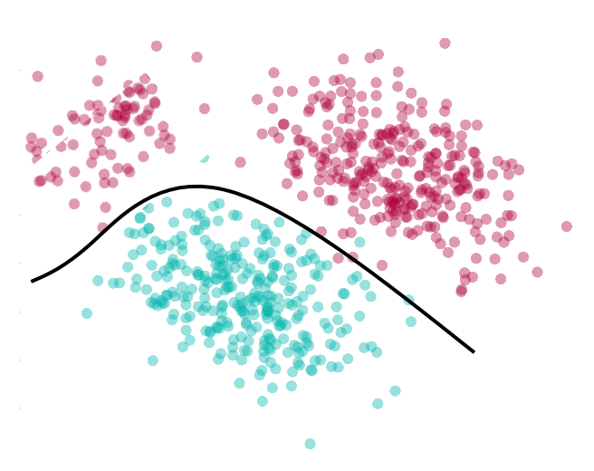

class: center, middle, bg_title, hide-count


```{r setup, include=FALSE}
options(
  tmltools.dir.version = FALSE,
  htmltools.preserve.raw = FALSE
)

knitr::opts_chunk$set(
  fig.retina = 3,
  warning = FALSE,
  message = FALSE,
  comment = "",
  out.width = "100%"
)
library(knitr)
library(xaringanExtra)
library(xaringanthemer)

library(tidyverse)
library(gridExtra)
library(here)

library(countdown)
library(metathis)

options(width = 59) # fit into the right-column slides

```


```{r xaringans, echo=FALSE}
# https://github.com/gadenbuie/xaringanExtra
use_tachyons()
use_share_again()
use_panelset()
use_clipboard()
use_editable(expires = 1)
use_freezeframe()
use_scribble()
use_extra_styles(
  hover_code_line = TRUE,         #<<
  mute_unhighlighted_code = TRUE  #<<
)
use_progress_bar(color = "#0051BA", location = "top")
```

```{r style-share-again, echo=FALSE}
style_share_again(
  share_buttons = c("twitter", "linkedin", "pocket")
)
```


```{r meta, echo=FALSE}
meta() %>%
  meta_general(
    description = "Artificial Intelligence and Machine Learning in Supporting Clinical Decision",
    generator = "xaringan and remark.js"
  ) %>% 
  meta_name("github-repo" = "CorradoLanera/ws-mlt") %>% 
  meta_social(
    title = "Artificial Intelligence and Machine Learning in Supporting Clinical Decision",
    url = "https://CorradoLanera.github.io/ws-mlt/#1",
    image = "https://github.com/CorradoLanera/ws-mlt/raw/main/img/cover.jpg",
    og_type = "website",
    og_author = "UBEP",
    twitter_card_type = "summary",
    twitter_creator = "@CorradoLanera"
  )
```

```{css, echo=FALSE}
.left-code {
  color: #777;
  width: 38%;
  height: 92%;
  float: left;
}
.right-code {
  color: #777;
  width: 55%;
  height: 92%;
  float: right;
  padding-top: 0.5em;
}
.left-plot {
  width: 43%;
  float: left;
}
.right-plot {
  width: 60%;
  float: right;
}
.hide-count .remark-slide-number {
  display: none;
}

.bg_title {
  position: relative;
  z-index: 1;
}

.bg_title::before {    
      content: "";
      background-image: url('img/bg1.png');
      background-size: contain;
      position: absolute;
      top: 0px;
      right: 0px;
      bottom: 0px;
      left: 0px;
      opacity: 0.3;
      z-index: -1;
}

```


```{r xaringan-themer, include=FALSE, warning=FALSE}
red <- "#f34213"
purple <- "#3e2f5b"
orange <- "#ff8811"
green <- "#136f63"
white <- "#FFFFFF"
pastel_orange <- "#F97B64"
blu_gray <- "#1F4257"
style_duo_accent(
    colors = c(
        red = red,
        purple = purple,
        orange = orange,
        green = green,
        white = white,
        pastel_orange = pastel_orange,
        blu_gray = blu_gray
    )
)
```


<br>
<br>
<br>
<br>
# **.orange[How] Machine .orange[Learning]**<br>and **Artificial .orange[Intelligence]** can<br>**Support Clinical .orange[Decision]**

<br>
<br>

**Biostatistics Seminaries** - Padova, 2022/05/27 -

Ph.D. Course in Specialistic Traslational Medicine "G.B. Morgagni"

Corrado Lanera | [**Unit of Biostatistics, Epidemiology, and Public Health**](https://www.unipd-ubep.it/)


---
class: hide-count
.panelset[
```{r, panelset = TRUE, out.width="70%"}
# The downloaded csv with graph data of your PubMed query
pmlt_path <- here("data/PubMed_Timeline_Results_by_Year.csv")

pmlt_path |> 
  read_csv(skip = 1L) |>  # The first line is the query!
  ggplot(aes(x = Year, y = Count)) + 
  geom_point() +
  geom_label(
    aes(label = glue::glue("Total = {sum(Count)}")),
    x = 1980,
    y = 1e4
  ) +
  labs(
    title = "Historical progression of MLT/AI papers in \"our\" field",
# The first line is the query :-)
    caption = read_lines(pmlt_path, n_max = 1)
  ) +
  theme(plot.caption = element_text(size = 7))  # It's a long query...
```
]


---
class: inverse, hide-count
# What we are going to see

Purpose of this seminary is to introducing .orange[what is] Machine Learning, why/in what is different from other (statistical) tools, how to understand (and .orange[trust]!) it's results, and looking at .orange[some example] and .orange[best practice] in conducing a machine learning project.

My principal aim is to let you able to .orange[understand] (and .orange[evaluate] the quality!) of a machine learning project when used for clinical purposes.

Spoiler: I do not show you any (other) R code... hopefully.


---
class: hide-count
# .orange[Acknowledgement]

The following slides and their contents were produced thanks to the preciuos work of .orange[**Paola Berchialla**]

.center[
```{r, echo=FALSE, out.width = "50%"}
knitr::include_graphics(c("img/thankyou-robot.jpg"))
```
]

<br><br>

> Special thanks also to .orange[**Cristiana Vettori**] for having supported me in all the administratives related to this presentation.


---
class: inverse, bottom, right, hide-count


```{r, echo=FALSE, out.width = "50%"}
knitr::include_graphics("img/profilo_CL.jpg")
```
# Find me at...


[`r fontawesome::fa("link")`](https://www.unipd-ubep.it/) [**www.unipd-ubep.it**](https://www.unipd-ubep.it/)

[`r fontawesome::fa("github")`](https://github.com/UBESP-DCTV)
**@UBESP-DCTV**

[`r fontawesome::fa("github")`](https://github.com/corradolanera)
[`r fontawesome::fa("twitter")`](https://twitter.com/corradolanera)
[`r fontawesome::fa("telegram-plane")`](https://telegram.me/CorradoLanera)
**@CorradoLanera**

[`r fontawesome::fa("mail-bulk")`](mailto:Corrado.Lanera@ubep.unipd.it) [**Corrado.Lanera**__.orange[@ubep.unipd.it]__](mailto:Corrado.Lanera@ubep.unipd.it)


---
class: inverse, middle
# .center[**.orange[Overview]**]

- .orange[**Overview**]: what does it means "Machine Learning"?

- .orange[**Classifiers**]

- Model .orange[**selection**] and .orange[**evaluation**]

- .orange[**Neural Networks**] and .orange[**Deep Learning**]

- A tour of Machine Learning .orange[**algorithms**] in healthcare

- .orange[**Best practices**] for implementing Machine Learning


---
class: inverse, middle, center, hide-count
# .orange[Overview]

What does it means "Machine Learning"?


---
# .orange[What is **Machine Learning**]
  

.bg-washed-green.b--dark-green.ba.bw2.br3.shadow-5.ph4.mt1[
  .left[
    Machine Learning deals with the study, the design and the development of algorithms that give computers the capability to learn without being **explicitly** programmed.
  ]
  
  .tr[
    — Arthur Samuel, 1959
  ]
]

```{r, echo=FALSE, message=FALSE, warning=FALSE, fig.align='center', out.width="70%"}
include_graphics("img/samuel.png")
```


---
# .orange[What is **Machine Learning**]
  
.bg-washed-green.b--dark-green.ba.bw2.br3.shadow-5.ph4.mt1[
  .left[
    A computer program is said to learn from **experience** (E) with respect to some class of **tasks** (T) and performance measure  (P), if its **performance** at the given task improves with **experience**
  ]
  
  .tr[
    — _Machine Learning_ - Mitchell, 1997
  ]
]

.pull-left[

```{r, echo=FALSE, message=FALSE, warning=FALSE, fig.align='center', out.width="100%"}
include_graphics("img/Tom-Mitchell-2.webp")
```
]
.pull-right[

<br>

**.orange[Learning]**: performance on **T** as measured by **P** improves with **E**.

<br>
<small>
  
E.g., Misclassification error (**P**) for diagnoses' classification (**T**) improves (i.e., become lower) after training on additional data (**E**).

E.g., Misclassification error (**P**) for diagnoses' classification (**T**) improves (i.e., become lower) after additional iterations of the training procedure (**E**) on the same data-set.
</small>
]

---
# .orange[What is **Machine Learning**]
  

.bg-washed-green.b--dark-green.ba.bw2.br3.shadow-5.ph4.mt1[
  .left[
    A task (red box) requires an appropriate mapping - a model- from data described by feature to outputs. **Obtaining** such mapping from training data is what constitute a .orange[learning problem] (blue box).
  ]
  
  .tr[
    — _Machine Learning_ - Peter Flach, 2012
  ]
]


.left-column[
```{r, echo=FALSE, message=FALSE, warning=FALSE, fig.align='center', out.width="100%"}
include_graphics("img/PeterCartoon-square.jpg")
```
]
.right-column[
```{r, echo=FALSE, message=FALSE, warning=FALSE, out.width="100%"}

```
]


---
# .orange[Task]
  
A __task__ is something the ML must carry out

- the process of learning itself is not the task

- _Learning_ is the act of generate models having the ability to perform the task


<br>
<br>


A __task__ is defined in terms of _how the ML should process a collection of Examples_, i.e. a .orange[dataset].

---
# .orange[Task: Example]
  
  
<small>

**Learning Problem** | Task **T**  
---------------------|------------
Learning Checkers    | **Playing checkers**
Handwriting recognition | **Recognizing/Classifying handwritten words/numbers within images**
Self-driving car | **Driving from A to B**
Diseases extraction from EHR | **classify EHR by the disease reported (in free-text natural language)** 
Describe patient movement in bed | **At any given time provide position and dynamics of patients**

</small>


---
# .orange[Performance]
  
A __performance__ is a quantitative measure for assessing the ability of ML

- performance is measured on the task being carried out

Usually __performance__ is measured in terms of:
  
- .orange[_accuracy_]: proportion of examples for which the model produces the correct output.

- .orange[_error rate_]: proportion of examples for which the model produces the incorrect output.

<br>
<br>
<br>
  

### .orange[**WARNING**: unbalanced data require balanced metrics!]
  
  
  
---
# .orange[Performance: Example]
  
<small>

**Learning Problem** | Task **T** | Performance **P** 
---------------------|------------|-------------------
Learning Checkers    | Playing checkers | **% games won **
Handwriting recognition | Recognizing/Classifying handwritten words/numbers within images | **% correctly classified words **
Self-driving car | Driving from A to B | **Average distance traveled before an error (as judged by humans)**
Diseases extraction from EHR | classify EHR by the disease reported (in free-text natural language) | **% of EHR correctly classified**
Describe patient movement in bed | At any given time provide position and dynamics of patients | **% average error in position or dynamics**

</small>

---
#.orange[Experience]
  
.orange[__Experience__] is primarily determined by the amount of supervision during the learning process and the availability of labeled data


---
#.orange[Experience: Example]
  
<small>

**Learning Problem** | Task **T** | Performance **P** | Experience **E** 
---------------------|------------|-------------------|-----------------
Learning Checkers    | Playing checkers | % games won | **playing (against itself)**
Handwriting recognition | Recognizing/Classifying handwritten words/numbers within images | % correctly classified words | **process data sets of handwritten words with given classification**
Self-driving car | Driving from A to B | Average distance traveled before an error (as judged by humans) | **Sequence of videos, still images, and steering commands recorded while observing a human driver**
Diseases extraction from EHR | classify EHR by the disease reported (in free-text natural language) | % of EHR correctly classified | **process EHRs with given classification**
Describe patient movement in bed | At any given time provide position and dynamics of patients | % average error in position or dynamics | **time-series of patient kinetic measures taken from wearable devices and bed weight sensors, and position and dynamics collected by videos recorded observing inbed patients**

</small>


---
# .orange[How do Machines **learn**?]
  
Machine learning is concerned with finding functions that **_best_ predict** outputs (responses), given data inputs (predictors)

$$Y \simeq f(X)$$ 
  


```{r, echo=FALSE, message=FALSE, warning=FALSE, fig.align='center', out.width="60%"}
knitr::include_graphics("img/ml-process.png")
```

.orange[_Learners_] are algorithms that improve their skills (in producing better models/functions) by learning from old/known .orange[__(training)__] data.

<br>
<br>

> A .orange[_learner_] uses data and experience to perform better over time (i.e., producing new models that performs better than the previous ones)


---
# .orange[How do Machines **learn**?]
  
  
  
.left-code[
In traditional programming:
- **provide** an algorithm (a finite set of instructions)
- **provide** .orange[input] data (no training/new distinction)
- **obtain** the desired result.


In machine learning:
- **provide** the .orange[training] input (data)
- **provide** the .orange[training] known/desired result
- **obtain** the .orange[learning algorithm] (ingesting _new_ data and returning _new_ outputs).

Machine Learning problems are .orange[*optimisation*] ones.

]

.right-plot[
  
```{r, echo=FALSE, message=FALSE, warning=FALSE, fig.align='center', out.width="100%"}
include_graphics("img/MLvsTrad.png")
```
]


---
# Types of .orange[learning]

#### .orange[Unsupervised] learning

> The input data is _not labeled_ (there are not right answers!)

Data is given to the model, which is left to learn optimal .orange[patterns]/.orange[clusters].


#### (Passive) .orange[Supervised] learning

> The learning algorithm is provided with a set of inputs along with the corresponding .orange[correct] outputs.

The algorithm compares its current inferred output with the correct one to learn from its .orange[errors] (i.e., to minimize it).


#### .orange[Active] learning

> The learning algorithm .orange[interactively] queries a user (the _oracle_) to label new data with the desired (correct) outputs.

With input data labeled on the fly by .orange[oracle's knowledge], the model cycles query/train stages on the left unlabeled data.


---
# .orange[Basic **components**]

.orange[Training dataset]: data used as input to the learner to train the model

.orange[Validation dataset]: data used by the learner for validation and optimization

.orange[Training model]: the ML artifact that comes out of the training process

.orange[Cost (or loss) function]: a function to optimize in the ML system (sum of squared errors over the training data set)

.orange[Test dataset]: data provided to the trained model for performance estimations


---
class: middle, hide-count, inverse

# .center[.orange[Break]]

(Unordered) tips: 
- get up
- stretch
- look _far away_ (relax your eyes)
- hydrate
- go to the bathroom

```{r, echo = FALSE}
countdown(minutes = 10, warn_when = 3, play_sound = TRUE,
          left = "65%", bottom = "5%")
```


---
class: inverse, middle, center, hide-count
# .orange[Classifiers]


---
class: middle center hide-count

```{r, echo=FALSE, message=FALSE, warning=FALSE, fig.align='center', out.width="100%"}
include_graphics("img/food.jpg")
```


---
# .orange[Classification]
  
```{r, echo=FALSE, message=FALSE, warning=FALSE, fig.align="center", out.width="80%"}
include_graphics("img/classification.png")
```


---
# .orange[Classification]
  
.left-code[
  __Feature space__
  
  - data: points in $\mathbb{R}^d$
    
    - dimensions:  scalar measurements
  
  <br>
    
    __Classifier functions (_classifiers_)__
  
  - a classifier for $K$ classes is a function
  
  $$
    f:\mathbb{R}^d \to \{1, \ldots, K \}   
  $$
    - classifiers carve up the space into regions
]

.right-plot[
  
```{r, echo=FALSE, message=FALSE, warning=FALSE, fig.align="center", out.width="100%"}

```
  
]


---
# .orange[Quantifying errors]
  
**Loss function** (for .orange[K] classes):

$$\rm loss: \{1, \ldots K\}\times \{1, \ldots K\} \to [0, \infty)$$

<br>

Usage:

$${\rm loss} (f(x), {\rm true\ class\ of\ }x)$$

<br>
<br>

> If all mistakes are equally bad:
$$\textrm {loss}(i, j) = \begin{array}{ll}
1 & \textrm {if } i\neq j  \cr
0 & \textrm {if } i= j  \cr
\end{array}$$
  
  
  
  
---
# .orange[Risk of classifier]
    
If the distribution of the classes is known, the .orange[risk] of classifier is the expected loss

$$
{\rm risk}(f) = \mathbb{E}[{\rm loss}(f(X), {\rm true\ class\ of\ } X)]
$$


We can evaluate the classifier by how large its risk is


The best way to possibly train a classifier is by simply minimizing its risk

  
  
  
---
# .orange[Nearest neighbor]
  
.orange[__Idea:__] use training data itself as classifier

- Given: data point $x$
  
  - Find training data point closest to $x$
  
  - Assign $x$ the label of closest point

.orange[__k-Nearest Neighbor (kNN)__]

- Find $k$ closest training points

- Take a majority vote between these points


> .orange[__Rule of thumb:__] 3NN often works surprisingly well


  
  
  
---
#.orange[Nearest neighbor]
    
    
```{r, echo=FALSE, message=FALSE, warning=FALSE, fig.align="center", out.width="60%"}

```

---
#.orange[Nearest neighbor (100 data points)]

```{r, echo=FALSE, message=FALSE, warning=FALSE, fig.align="center", out.width="70%"}
include_graphics("img/knn_2.png")
```

---
#.orange[kNN: drawbacks]

In large dataset, finding nearest data point is expensive

Computational burden grows with dimension

> it is the method of choice when dataset is small

<br>
<br>
<br>
<br>

__What to do for large dataset:__

- Extract a concise summary


---
#.orange[Linear classifiers] 

```{r, echo=FALSE, message=FALSE, warning=FALSE, fig.align="center", out.width="70%"}
include_graphics("img/linear_classifier_4.png")
```


---
# .orange[Linear classifiers] 

```{r, echo=FALSE, message=FALSE, warning=FALSE, fig.align="center", out.width="70%"}
include_graphics("img/linear_classifier_3.png")
```


---
# .orange[Linear classifiers] 

```{r, echo=FALSE, message=FALSE, warning=FALSE, fig.align="center", out.width="70%"}

```

.center[draw the convex hull]


---
#.orange[Linear classifiers:<br>Maximum margin hyperplane] 


```{r, echo=FALSE, message=FALSE, warning=FALSE, fig.align="center", out.width="70%"}
include_graphics( "img/linear_classifier_6.png")
```
  

.footnote[An hyperplane is a subspace of co-dimension = 1 of a space.]
---
#.orange[Linear classifiers:<br>Maximum margin hyperplane] 
  
<br>

```{r, echo=FALSE, message=FALSE, warning=FALSE, fig.align="center", out.width="70%"}

```


---
#.orange[Linear classifiers: Support Vector Machine] 


A maximum margin classifier is called __Support Vector Machine__

Training a SVM is a .orange[convex] optimization problem

> Empirically, SVM are among the most powerful (and fast) classifiers


---
# .orange[Limitations of linear classifiers]

.pull-left[
  
  Problem 1: **curved optimal decision boundary**
    
    - SVM solves Problem 1 using the so-called .orange[_kernel trick_]
  
  <br>
    <br>
    
    Problem 2: **classes may overlap**
    
    - SVM solve Problem 2 by:
    
    - permitting .orange[misclassified] training points
  
  - each such point contributes a .orange[_cost_] to the optimization target function
  
  - using the .orange[kernel tricks]
  
]

.pull-right[
```{r, echo=FALSE, message=FALSE, warning=FALSE, fig.align="center", out.width="100%"}

```
]


---
# .orange[Example of the kernel trick]

Suppose you have .orange[non-linearly separable] data


```{r, echo=FALSE, message=FALSE, warning=FALSE, fig.align="center", out.width="70%"}

```

> Accuracy of classification given by the linear classifier: .orange[75%]


---
# .orange[Example of the kernel trick]

Project it into a three-dimensional space where the new coordinates are 

.left-column[
$$\begin{cases}
X_1 &= y_1^2 \\
X_2 &= y_2^2 \\
X_3 &= \sqrt{2}y_1y_2
\end{cases}$$
]

.right-column[
```{r, echo=FALSE, message=FALSE, warning=FALSE, fig.align="center", out.width="90%"}
include_graphics("img/kernel.gif")
```
]


---
# .orange[Example of the kernel trick]

Run the SVM on the trasformed data 

.right-column[
```{r, echo=FALSE, message=FALSE, warning=FALSE, fig.align="center", out.width="90%"}
include_graphics("img/kernel_2.gif")
```
]


---
# .orange[Example of the kernel trick]

Now you got completely linearly separable data


```{r, echo=FALSE, message=FALSE, warning=FALSE, fig.align="center", out.width="70%"}

```

> Accuracy of classification given by the SVM classifier: .orange[100%]


---
#.orange[Limitations of linear classifiers]

Problem 3: more than two classes 

- Can be addressed by combining multiple linear classifier

<br> 
<br> 

> Some classifiers naturally apply to more classes, e.g., kNN.


---
# .orange[Ensemble classifiers]

__Ensemble Classifier__

- trains .orange[many _weak_] classifiers

- .orange[combines results] by majority vote

<br>

__Error rate__

- proportion of miclassified points

- expected number of error

<br>


__Weak classifier__

- consider two classes of equal size

- assign class by coin flip: 50% expected error

- weak classifier: .orange[error rate slighly below 50%]


---
# .orange[Classification by majority vote]

$m$ classifiers take a vote 

> let us suppose $m$ is an odd number

Two choices:
- correct = $1$
- wrong = $-1$

Decision is made by simple majority

- for two classes and classifiers $f_1,\ldots ,f_m$ with output $\pm1$
majority vote at input $x$ is
$$\rm sgn \left( \sum_{j=1}^m f_j(x)\right)$$


---
# .orange[Classification by majority vote]

Does the majority make the right choice?

.pull-left[
  Let's assume

-  each classifier makes the right choice with probability $p\in [0,1]$

- votes stochastilly independent when regarded as random outcomes
]


.pull-right[
```{r, message = FALSE, warning=FALSE, echo = FALSE, fig.align='center', out.width="100%", background='transparent'}

vote_class_plot <- function(p = 0.55) {
  n_classifier <- 1:250
  y <- 1 - pbinom(n_classifier/2, n_classifier, prob = p)
  
  data.frame(n_classifier, y) |> 
    ggplot(aes(x = n_classifier, y = y)) +
      geom_smooth() + 
      xlim(1, 250) +
      xlab(glue::glue('no of classifiers\n p = {p}')) +
      ylim(0,1) +
      ylab('Probability')
}

vote_class_plot()
```
]


---
# .orange[Classification by majority vote]

```{r, message = FALSE, warning=FALSE, echo = FALSE, fig.align='center', out.width="70%"}

layout(matrix(c(1,2,3,3), nrow = 2, byrow = TRUE))

grid.arrange(
  vote_class_plot(.15), 
  vote_class_plot(.33), 
  vote_class_plot(.45), 
  vote_class_plot(.55), 
  vote_class_plot(.66), 
  vote_class_plot(.85), 
  nrow = 2)
```


---
# .orange[Majority vote]

Combining weak learner by voting is beneficial<br> .orange[if they are stochastically independent]


But... .orange[training data creates dependence]


<br>
<br>
<br>

Ensemble classifiers use various strategies to produce weak learners that are only weakly dependent

> Important examples: .orange[Random Forests]


---
# .orange[Weak learner: tree classifier]


```{r, echo=FALSE, message=FALSE, warning=FALSE, fig.align="center", out.width="70%"}
include_graphics("img/tree_1.png")
```


---
# .orange[Weak learner: tree classifier]

```{r, echo=FALSE, message=FALSE, warning=FALSE, fig.align="center", out.width="70%"}

```


---
# .orange[Weak learner: tree classifier]

```{r, echo=FALSE, message=FALSE, warning=FALSE, fig.align="center", out.width="70%"}
include_graphics("img/tree_3.png")
```


---
# .orange[Weak learner: tree classifier]

```{r, echo=FALSE, message=FALSE, warning=FALSE, fig.align="center", out.width="70%"}

```

---
# .orange[Weak learner: tree classifier]


.pull-left[
```{r, echo=FALSE, message=FALSE, warning=FALSE, fig.align="center", out.width="90%"}

```
]
.pull-right[
```{r, echo=FALSE, message=FALSE, warning=FALSE, fig.align="center", out.width="90%"}

```
]


---
# .orange[Randomized ensemble of Trees]

.orange[Training]: Input $n$ training points of classes $1,\ldots, K$

  - select $n$ points uniformly at random with replacement
  
  - train a tree on the randomized data set

<br>


.orange[repeat] $m$ times

  - $m$ trees

<br>

.orange[Classification]: input unlabeled data point $x$

  - compute class label of $x$ under each of the $m$ trees

  - take majority vote


---
# .orange[Randomized ensemble of Trees] 

Tree ensemble performs reasonably well (but not as SVM):

> tree classifiers still too dependent

<br>
<br>

Recall: tree training

 >in each step, computes best split point along each axix then split the axis that minimizes error So, .orange[split is optimized over all axes]!


<br>
<br>

Idea: In each step, select (small) .orange[random subset of axes] and only optimize over those.


---
# .orange[Random forest]

.orange[Tree training]: Input $n$ training points of classes $1,\ldots, K$

  - select $n$ points uniformly at random with replacement

  - train a tree on the randomized data set

<br>

.orange[For each tree]:

  - in each step, select $l$ axes at random
  
  - compute best split point for each of these axes
  
  - split along the oone that minimizes error

<br>

> .orange[Train $m$ trees in total]
>
>  - compute class label of new point $x$ under each of the $m$ trees
>  - take majority vote


---
#.orange[Random forest: hyperplane]


```{r, echo=FALSE, message=FALSE, warning=FALSE, fig.align="center", out.width="70%", fig.cap='2 classes classification'}
include_graphics("img/hyperplane.png")
```

---
#.orange[Random forest: hyperplane]

```{r, echo=FALSE, message=FALSE, warning=FALSE, fig.align="center", out.width="65%", fig.cap='Hyperplane for XOR pattern'}

```


---
# .orange[Summary]

Ensemble .orange[combine weak classifiers] by voting

<br>

A lot of variance between classifers is beneficial

<br>

Random forest (and SVMs) are among the best classifiers available

<br>

If weak classifier is applicable to $>2$ classes, so it is ensemble


---
class: inverse, middle, center, hide-count
# .orange[Model selection]


---
# .orange[Error for a classifier]


.orange[Training error] for a classifier:

$$\rm Training\ error = \frac{no\ of\ miclassified\ training\ points}{no\ of\ training\ points}$$


.orange[Prediction error] for a classifier

  - harder to define: with respect to which distribution?
  
  - ideally the distribution of the underlying data source

$$\rm Prediction\ error = \mathbb{E}(proportion\ of\ misclassified\ points)$$

<br>
<br>

Assuming all error costs the same: .orange[ __prediction error__] is the risk


---
# .orange[Overfitting]


Sample data acts as proxy for underlying data source

.orange[_Overfitting_] means adapting too closely to the idiosyncrasies of a sample set

<br>
<br>
<br>
<br>

**Result**: Small error on training data but .orange[poor predictive performance]!


---
class: center, middle, hide-count

```{r, echo=FALSE, message=FALSE, warning=FALSE, fig.align="center", out.width="100%"}
include_graphics("img/overfit.jpg")
```


---
# .orange[Parameters]

.orange[Tree classifier]

  - Number of splits

<br>

.orange[Tree ensemble]

  - tree parameters

  - number of trees

<br>


.orange[Random forest]

  - tree parameters

  - number of trees

  - number of random dimensions


---
#.orange[Parameters Vs. hyper-parameters]

```{r, echo=FALSE, message=FALSE, warning=FALSE, fig.align="center", out.width="90%"}
include_graphics("img/overfitting_5.png")
```


---
# .orange[Terminology]

> Example: Tree

<br>
<br>

__Model:__  Family of classifiers

- All trees with $k$ splits

<br>

__Parameter__  Indexes different classifiers within model

  - Split locations

<br>
  
__Hyperparameter__  Indexes different  models

  - $k$


---
# .orange[Overfitting]

Model is .orange[not able to generalize]

Learn the data and .orange[not the underlying function]

Performs well on training data but .orange[poorly with new data]

<br>

```{r, echo=FALSE, message=FALSE, warning=FALSE, fig.align="center", out.width="90%"}
include_graphics("img/figure3.png")
```


---
# .orange[Overfitting: example ]

Two alternative models of human papillomavirus infection and its progression to cervical cancer (CIN) 

The complex model includes multiple stages of pre-cancerous lesions which can progress or regress at different rates (model parameters) 

<br>

```{r, echo=FALSE, message=FALSE, warning=FALSE, fig.align="center", out.width="100%", fig.cap="Basu 2013"}

```


---
# .orange[Overfitting ]

Prevalence data of (CIN) generated using more complex model over a 30-year period among a fictional cohort of young women

The complex model (in green) actually has a better .orange[_fit_] to the early prevalence data (solid red dots) than does the simpler model (in blue)...

However, the complex model produced a pattern that poorly forecasts future prevalence (hollow red dots)


```{r, echo=FALSE, message=FALSE, warning=FALSE, fig.align="center", out.width="60%"}
include_graphics("img/Figure_9.png")
```


---
# .orange[Overfitting]

Every additional parameter in the model introduces new sources of uncertainty and potential to affect results in non-intuitive ways that may either be useful or deceptive

Complex models must be well-characterized in terms of their behavior before they are used for .orange[__forecasting__ ]


---
#.orange[Cross-validation]

> How to select an adequate model based on sample data?


.orange[__Recall__]: model selection chooses a model complexity (hyperparameter)
  
  - Training a classifiers chooses parameter values
  
  - The training can often be formulated as minimizing the training error

<br>
<br>

.orange[Model selection cannot be performed by minimizing the training error]

  - it would lead to overfitting


---
# .orange[Cross-validation]


> How to select an adequate model based on sample data?


.orange[**Recall**]: we use sample data as proxy for actual data source
   
  - ask how to select a model if the underlying distribution was known

  - apply sample principle

  - approximate data source by sample data

<br>
<br>


This is called .orange[__cross-validation__ ]

---
# .orange[Cross-validation]

If we knew underlying distribution
  
  - train classifiers with .orange[different hyperparameters] on training data
  
  - compute prediction errors under true distribution
  
  - choose the one with .orange[smallest prediction error]

<br>


.orange[Separating model selection and training] prevents overfitting

<br>

Approximation of actual data source by sample data


  -  split training data set
  
  -  train on set 1
  
  -  test predictive performance on set 2


---
# .orange[Cross-validation]

Data splitting estimates the .orange[predicion error from data]

<br>

Prediction error estimates can be used in two ways

  - model selection $\Leftrightarrow$ .orange[optimize] performance

  - classifier assessment $\Leftrightarrow$ .orange[interpret] performance (estimates the prediction error of the final choice of classifier)


<br>
<br>


.orange[We must not use the] .red[same data for both]


---
# .orange[Cross-validation]

1. Split data into three sets

  a. training set
  
  b. validation set
  
  c. test set (hold out set)


2. Train classifiers with .orange[different hyperparameters] on training set

3. Select that with smallest .orange[prediction error on validation set]

4. Estimate .orange[performance on test set]

<br>

.orange[Separate test set is crucial]:

  - prediction error estimate on validation set is confounded by model selection


---
# .orange[Cross validation: how to split the data]

If samples assumed i.i.d., split at random

  - sampling w/o replacement
  
<br>

Remaining question: .orange[how large] should be each set be?


<br>

Advantages of different choices

  - Large training set $\Leftrightarrow$ .orange[more accurate] classifier
  
  - Small training set $\Leftrightarrow$ .orange[reflects variation] between sample sets


---
# .orange[Leave-one-out cross-validation]


For every data point $x_i,\ i = 1, \ldots, n$:

  - train the model on every point except the single point $X_i$,
  
  - compute the validation error on the held out point


<br>

Average the test error


---
class: hide-count
# .orange[Leave-one-out cross-validation]

```{r, echo=FALSE, message=FALSE, warning=FALSE, fig.align="center", out.width="90%"}

```


---
class: hide-count
# .orange[Leave-one-out cross-validation]

```{r, echo=FALSE, message=FALSE, warning=FALSE, fig.align="center", out.width="90%"}

```


---
#.orange[K-fold cross validation]


0. .orange[Remove test set] and set it aside

1. Divide remaining data into $K$ .orange[equally sized] blocks

2. Cross-validate: for $k = 1,\ldots, K$

  - remove block $k$ from training data
  
  - train classifier on remaining bloks.
  
  - estimate prediction error on block $k$
  
3. Estimates over all $k$ and select best classifier

4. When classifier is chosen, estimate its performance .orange[on test set]


---
# .orange[K-fold cross validation]

The misclassification error rate is computed on the observations in the held-out fold. 

```{r, echo=FALSE, message=FALSE, warning=FALSE, fig.align="center", out.width="100%"}
include_graphics("img/Cv1.png")
```


---
# .orange[K-fold cross validation]

This procedure is .orange[repeated K] times; each time, a different group of observations is treated as a validation set.


```{r, echo=FALSE, message=FALSE, warning=FALSE, fig.align="center", out.width="100%"}

```

---
# .orange[K-fold cross validation]

The .orange[CV error rate] is then calculated as the average of these K error rates.


```{r, echo=FALSE, message=FALSE, warning=FALSE, fig.align="center", out.width="100%"}
include_graphics("img/Cv3.png")
```


---
# .orange[K-fold cross validation: how many folds?]

```{r, echo=FALSE, message=FALSE, warning=FALSE, fig.align="center", out.width="100%"}
include_graphics("img/splits.png")
```

Generally, .orange[k between 5 and 10] avoids over-training the model (variance), whilst avoiding too few training points (bias)


---
# .orange[Bias and Variance trade-off]

In order to minimise test error on new data points, statistical theory (out of the scope of this workshop) tells us that we need to select a function that achieves .orange[*low variance*] and .orange[*low bias*].


 - .orange[**Variance**] refers to the amount by which our predictions would **change if we estimated using a different training set**. 
   > The more flexible the model, the higher the variance.

 - .orange[**Bias**] refers to the **error that introduced by the approximation** we are making with our model (represent complicated data by a simple model). 
   > The more simple the model, the higher the bias.

There is a .orange[trade off] between increasing variance (flexibility) and decreasing bias (simplicity) and vice versa.

```{r, echo=FALSE, message=FALSE, warning=FALSE, fig.align="center", out.width="40%"}
include_graphics("img/tradeoff.png")
```


---
class: hide-count
#.orange[Bias variance trade-off]


The bias-variance trade-off concerns the generalizability of a trained predictor in light of new data points

If a predictor has high bias and/or high variance, it will not do well in predicting on new data

```{r, echo=FALSE, message=FALSE, warning=FALSE, fig.align="center", out.width="60%"}
include_graphics("img/BV.png")
```


Good, generalizable predictors need to have .orange[both low bias and low variance]


---
#.orange[Summary]


Cross-validation .orange[selects model] and .orange[assess classifier]

  - Both require estimate the prediction error


Estimates are obtained from .orange[separate training and test data sets]


Assessment must use .orange[separate validation] set

  - otherwise classifier ability is systematically overestimated

<br>

To interpret machine learning results

  - ask yourself: .orange[did the researchers who trained the model have access to validation data?]

  > .orange[**if so, results could be possibly confounded.**]


---
class: inverse, middle, center, hide-count
# .orange[A tour of Machine Learning algorithms<br>in healthcare]


---
# .orange[ML algorithms]

Hundreds new algorithms every year

More than 100 Wikipedia pages on specific ML algorithms

> many of them are variation on a few major classes

---
# .orange[Classifier]

Does data belong to class A? .orange[_is this really a heart failure patient?_]

<br>

Classifiers are the most commonly used ML algorithms in analytics applications


  -  Suggest possible patient diagnoses

  - Identify patients with high readmission risk

  - Automatically alert care providers early in the development of sepsis

  - Define the threshods for _abnormal_ lab results

  - Automatically differentiate between clinical and administrative documents

  - Recommend the most effective wellness or disease management intervention for a patient

  -  many, many more...

---
# .orange[Classifiers: logistic regression]


.orange[__Logistic regression__] is the workhorse of classifers


  - it uses a single, straight cut to divide the world of possible features into two groups
    
$$\ln\left(\frac{p}{1-p} \right) = \beta_0 + \beta_1 X_1 + \ldots + \beta_p X_p$$


---
# .orange[Classifiers: Support Vector Machine]

.orange[**SVM**] is a linear classifier with a twist

The world of possible features is split by a single line as in logistic regression, but .orange[this line can be curved]. 

This additional flexibility makes SVM highly adaptable

> Because of the way the curvature is introduced (though a _kernel_), SVM are still .orange[simple to compute and interpret].


---
# .orange[Classifiers: decision trees]

Family of algorithms, all based on the idea of creating a tree of decisions about features that lead to a specific classification

  - Is ejection fraction above or below 50?
  
  - to identify heart failure, the algorithm may start with ejection fraction 


For each of these paths, a new question is considered

  - does the echocardiogram show Left Ventricle Hypertrophy?

<br>

At the end of each series of questions the patient falls into either a .orange[heart failure] or a .orange[not heart failure] diagnosis (bucket)

---
class: hide-count
# .orange[Classifiers: decision trees]

```{r, echo=FALSE, message=FALSE, warning=FALSE, fig.align="center", out.width="100%"}

```

---
# .orange[Classifiers: random forest]

Improves upon decision trees by dividing the input data into .orange[many different subsets] and creating a different decision tree for each of them
  - All of the different resulting decision trees then .orange[vote] to determine the final classification of the input

<br>

Reduces the risk of making the final buckets too small and subsequently being fooled by random variations in the original labeled training data


---
# .orange[Classifiers: Neural Networks] 

(Naive) .orange[__definition:__] An Artificial Neural Network is an information processing paradigm that is inspired by the way biological nervous systems process information:

  - A large number of highly interconnected simple processing elements (neurons) working together to solve specific problems


---
# .orange[Classifiers: Neural Networks] 

.pull-left[

- an .orange[input layer] of neurons
- one or more .orange[hidden layers]
- an .orange[output layer]

<br>

- Each internal node receives inputs from other units
- A weight $w$ is associated to each input
- The unit computes a function of the weighted sum of its inputs
- Outputs are compared with target to compute the value of some predefined error function
- The error is feedback through the network
  - the algorithm adjust the weights of each connection to reduce the value of the error function
]


.pull-right[
```{r, echo=FALSE, message=FALSE, warning=FALSE, fig.align="center", out.width="70%"}

```

```{r, echo=FALSE, message=FALSE, warning=FALSE, fig.align="center", out.width="70%"}

```
]


---
# .orange[Clustering]

Can the data be grouped into natural categories or buckets?

.orange[_Are there natural groupings that can help me understand my patients?_]


---
# .orange[Clustering: Unsupervised]

  - Can automatically identify naturally occurring groups of similar items
  
  > E.g., .orange[K-Means]: the algorithm is given a set of attributes and a number of clusters to create

  - the algorithm works out which combinations of attributes most accurately divide the items into that number of groups 

  - attributes: for example, diagnoses and lab measurements


<br>
<br>

 > resulting _clusters_ are .orange[interpreted by humans] by looking at
which attributes are most important in the cluster


---
# .orange[Clustering: Hierarchical]


Creates a tree or dendogram of clustering scenarios for data

  - starts creating a single cluster containing all the items

  - splits into two clusters, each of which further splits into two clusters, $\ldots$  until each cluster contains only a single item. 

  - the process can be stopped at any point to create meaningful clusters


---
# .orange[Clustering: examples]


.orange[__Risk adjustement__]

  - when calculating the impacts of different treatments, the baseline level of illness for each patient needs to be computed to create a consistent baseline for comparison of methods across all patients 

  - Clustering can be used to group patients into meaningful groups of similar comorbidities or risks

<br>
<br>

.orange[__Patients like mine__]

  - In the care of complex or rare disease, understanding how different treatments have worked on other patients in similar situations

  - Identifyimg subtype of disease

  - Clustering can be very useful to identify the most similar patients.


---
class: inverse, middle, center, hide-count
# .orange[ Best practices for implementing<br>Machine Learning]


---
# .orange[Ask a Specific Question]

ML algorithm should answer a .orange[very specific question]

The best first question is something already known to have a reference and some intuition to compare results with


---
# .orange[Start simple]

.orange[Keep it simple] both for model selection and data for your analysis

  - start with the minimal set of data that could get you to a good result


<br>


.orange[Keep robustness]

  - less model complexity and fewer parameters are always beneficial 


<br>

> .orange[Start quickly and simple, and next iterate!]


---
# .orange[Try Many Algorithms]

Try a few different algorithms to see how they work


If one classifier works incredibly well and another doesn't seem to work well at all, .orange[be cautious]

- maybe overfitting situation, not really have much predictive power 


.orange[Combine methods]

The better your features, the better your performance will be

Data is more important than the exact algorithm you use  

- more training data is always desirable. 

<br>
  
  > .orange[start with SVM or RF (or even with simple linear regression!)]


---
# .orange[Treat data with suspicious]
  
  Look at the data 

- dig into its details 

- look for correlations

- systematic biases, errors, and flaws


<br>
  <br>
  
  .orange[Normalize] input data 

- ML algorithms can perform .orange[poorly and slowly] if there are large differences in scale between different features


---
# .orange[Validate your Model]
  
  Separate your data into .orange[training, validation, and test sets]

- if you are using K-fold cross validation, at least hold out a test set 

<br>
  <br>
  <br>
  
  > .orange[If you take ANY decision after having seen a performance on a data set, it becomes a training one (even if you have treated it as a test)]


---
# .orange[Healthcare does not trust black boxes]
  
  Some ML methods are more transparent than others    

- Clustering, tend to be easy to interpret, because they create groupings of concepts      

- Linear regression can tell how important each feature is to the final output 


<br>
  
  Random forests are .orange[difficult to interpret]. 

Neural networks, deep learning are .orange[truly black boxes]

- very little transparency to what is important in the decision making process


---
# .orange[Monitoring ongoing performance & keep track of model changes] 
  
  Check your results against incoming new data 

- monitor data and algorithm statistics with a dashboard

<br>
  
  .orange[Track the revision of your model] along with data analytics pipeline


---
# .orange[Do not be fooled by Accuracy]
  
  While looking for a rare event that only happens 1% of the time,  you can report your accuracy as 99% 
  
  - meaningless 

<br>
  
  Before starting a project, better figure out which precision and recall application requires to be useful

> - .orange[Build the model with these metrics on your mind]
> - .orange[Use balanced metrics]


---
class: inverse, center, middle, hide-count
# Thanks!
# `r anicon::faa('thumbs-up', animate='float', size=5)`

<br>
  
  .right[
    [`r anicon::faa("envelope", animate = "passing")`](mailto:corrado.lanera@ubep.unipd.it) [corrado.lanera@ubep.unipd.it](mailto:corrado.lanera@ubep.unipd.it)
    
    [`r anicon::faa("calendar-check")`](https://calendly.com/corradolanera) [calendly.com/corradolanera](https://calendly.com/corradolanera)
    
  ]


---
class: hide-count
# .orange[Outline **.orange[A]**]

- Topic **one**

- Second **topic**

- Another **interesting** topic


---
class: inverse, middle, center, hide-count
# .orange[Topic **one**]
 

---
# Foo


---
class: inverse, middle, center, hide-count
# .orange[Second **topic**]
 

---
# Bar


---
class: inverse, middle, center, hide-count
# .orange[Another **interesting** topic]
 
 
---
# Tar


.panelset[
.panel[.panel-name[XXXXX]
foo
]
.panel[.panel-name[XXXXX]
bar
]
]
```{r, echo = FALSE}
countdown(minutes = 15, warn_when = 3, play_sound = TRUE,
          left = "70%", bottom = "20%")
```


```{r, echo=FALSE, out.width="80%", fig.cap="https://www.unipd-ubep.it/"}

knitr::include_graphics("img/UBEP.png")

```


---
class: inverse
# Risorse utili


---
class: inverse, center, middle, hide-count


.bg-washed-green.b--dark-green.ba.bw2.br3.shadow-5.ph4.mt5[
.left[
_If you think the only acceptable performance is the ".orange[perfect performance]",<br>AI is not for you!<br>But, I've heard that even humans have made mistakes..._
]

.tr[
— Daniel Oberski<br>2021/03/26 ASReview interview<br>https://daob.nl/
]
]

<br>
# Thank .orange[you] for the attention!


<br>
<br>

Slides: <SLIDES' URL>


[`r fontawesome::fa("link")`](https://www.unipd-ubep.it/) [**www.unipd-ubep.it**](https://www.unipd-ubep.it/) | 
[`r fontawesome::fa("mail-bulk")`](mailto:Corrado.Lanera@ubep.unipd.it) [**Corrado.Lanera@ubep.unipd.it**](mailto:Corrado.Lanera@ubep.unipd.it)

[`r fontawesome::fa("github")`](https://github.com/corradolanera)
[`r fontawesome::fa("twitter")`](https://twitter.com/corradolanera)
[`r fontawesome::fa("telegram-plane")`](https://telegram.me/CorradoLanera)
**@CorradoLanera** | 
[`r fontawesome::fa("github")`](https://github.com/UBESP-DCTV)
**@UBESP-DCTV**


